# Random Forest Classification and Regression

## Overview
Random Forest is an ensemble learning method that combines multiple decision trees to create a more robust and accurate model. It uses:
- **Bagging**: Bootstrap sampling of training data
- **Random Feature Selection**: Subset of features at each split
- **Voting/Averaging**: Combines predictions from all trees

## Random Forest Architecture


## Random Forest Classification

### Process Flow


### Classification Example

```mermaid
graph LR
    subgraph "Tree Predictions"
        T1[Tree 1: Cat 🐱]
        T2[Tree 2: Dog 🐶]
        T3[Tree 3: Cat 🐱]
        T4[Tree 4: Cat 🐱]
        T5[Tree 5: Cat 🐱]
    end
    
    T1 --> V[Voting System]
    T2 --> V
    T3 --> V
    T4 --> V
    T5 --> V
    
    V --> R[Result: Cat 🐱<br/>4 votes vs 1 vote]
    
    style V fill:#f3e5f5
    style R fill:#e8f5e8
```


## Random Forest Regression

### Process Flow


### Regression Example


## Feature Selection Process


## Key Differences

| Aspect | Classification | Regression |
|--------|----------------|------------|
| **Output** | Class labels | Continuous values |
| **Combination** | Majority voting | Averaging |
| **Example** | Spam/Not Spam | House price prediction |
| **Metrics** | Accuracy, Precision, Recall | MSE, RMSE, MAE |

## Advantages of Random Forest


## Hyperparameters


## Implementation Example (Python)

```python
from sklearn.ensemble import RandomForestClassifier, RandomForestRegressor
from sklearn.model_selection import train_test_split
from sklearn.metrics import accuracy_score, mean_squared_error

# Classification
rf_classifier = RandomForestClassifier(
    n_estimators=100,
    max_depth=10,
    random_state=42
)

# Regression
rf_regressor = RandomForestRegressor(
    n_estimators=100,
    max_depth=10,
    random_state=42
)

# Training and prediction
rf_classifier.fit(X_train, y_train)
y_pred = rf_classifier.predict(X_test)
accuracy = accuracy_score(y_test, y_pred)
```

## When to Use Random Forest

- **Good for**: Mixed data types, missing values, feature selection
- **Avoid when**: Interpretability is crucial, very large datasets, real-time predictions
- **Best practices**: Tune hyperparameters, check feature importance, use cross-validation
